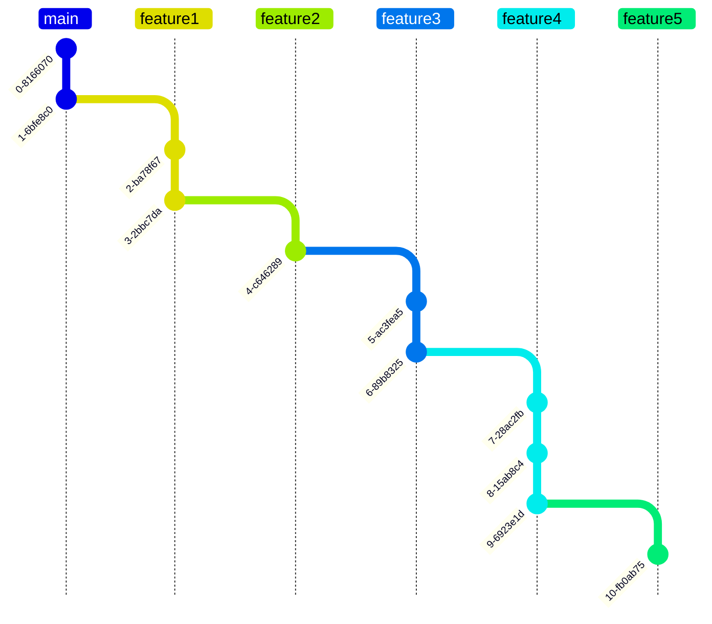
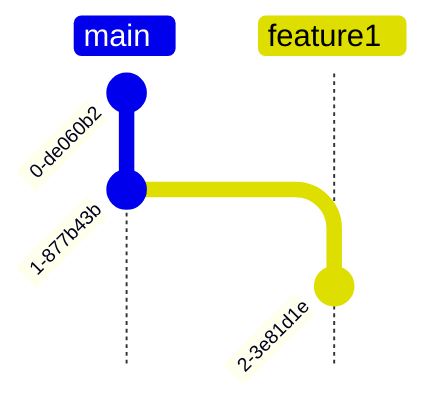
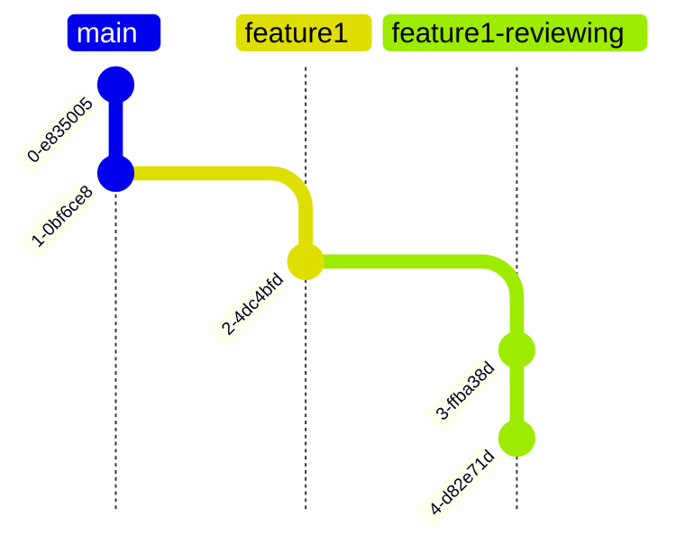
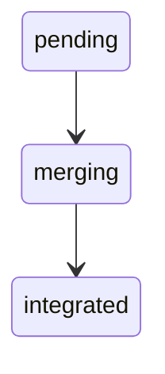

This repository defines the process and tools to work on a project that is kept
up-to-date with a remote (so-called upstream) repository.

When working with open-source projects, new features or bug fixes can be  
needed. Using plugins or hooks to add features is generally recommended without 
having to fork. However, sometimes this is not possible (bugfix, core features...). 
The process defined here helps maintain a fork where managing pending 
contributions before reaching upstream will be simple.

## The workflow

The workflow consists of a set of features where each feature is built on top of
another. Each new feature is checked out from its parent's HEAD. The last feature
branch holds all previous feature's commits. In general, the idea is merge upstream
fast and don't stop working locally until merged.

In a graph, this means:

So, feature 2 rebases on top of feature1, feature3 rebases on top of feature2, and so on ...

When a feature, let's say feature1, enters into reviewing mode due to a merge request,
feature1 will not be sent upstream but a new branch called feature1-reviewing.



Usually, during that reviewing process, new commits might be added or removed, for example


The process of generating the final target branch will still be the rebasing against all 
feature branches, but feature1 is marked as "merging" in the file.

Once all fixups, rebases, etc, of the feature branch going upstream are done, the branch
must be integrated back with the `integrate` command. This is done on the `sync` process
by skipping feature1, and rebasing feature2 but on top a new main, the one with
feature1-reviewing merged.


## Configuration file

You create and periodically update this file by hand.
(Possibly, in the future, we can create integration plugins for GitHub and GitLab for updating statuses automatically.)

```TOML
[[remotes]]
name = "origin"
url = "git@github.com:fluendo/git-upstream-workflow.git"

[target]
remote = "origin"
branch = "final"

[source]
remote = "origin"
branch = "main"

[[features]]
remote = "origin"
name = "feature1"
pr = "https://github/fluendo/git-upstream-workflow/pull-requests/10"
status = "integrated"

[[features]]
remote = "origin"
name = "feature2"
pr = "https://github/fluendo/git-upstream-workflow/pull-requests/10"
status = "merging"

[[features]]
remote = "origin"
name = "feature3"
status = "pending"
```

The configuration must include the list of remotes under the `[[remotes]]` section. This is useful
when the upstream branch is done in a git provider like GitLab but the development is done in GitHub.

There are three special sections, `[source]`, `[target]` and `[upstream]`:

* The `[source]` section defines the branch you want to apply your features into.

* The `[target]` section defines the branch that should hold all the features after applying them
  into `[source]`.

* The `[upstream]` is optional and defines the branch of the project you want to contribute to. The goal of
  having two destination base branches, `[source]` and `[upstream]`, is to differentiate the `sync` process
  from other operations. When `syncing` all features are applied into `[upstream]` because you want to sync
  with upstream changes and apply yours on top. All other operations use the `[source]` section to continue
  making modifications on the feature list. If `[upstream]` is not defined, `[source]` will be used.

The `[[features]]` section defines the list of features you want to include upstream (the `target` branch).
Each feature has the following key/value pairs:
`remote`
: The remote name as listed in the `[[remotes]]` section

`name`
: The name of the branch

`pr`
: The URL used for the merge-request/pull-request

`status`
: This defines how `guw` should handle the `sync` process.
Features with the same status compose groups in a strict order:

1. `integrated` - already integrated, nothing to do;
the dependant features have been rebased already and the actual feature is no longer considered in any process.
1. `merging`, the branch has already opened a merge-request/pull-request
and is waiting for the community to be reviewed
1. `pending`, this branch is still not requested to be integrated on the upstream project.

You cannot mix these groups.




Internal reviews done before adding a feature must be done before updating the toml file, and the target branch 
must always be in a valid state without conflict. A similar workflow must be used to update or remove a feature. The 
`guw` tool provides commands to `add`, `update`, and  `remove` features. More info about these use cases are 
described into [here](docs/workflows.md).

## Usage
First you need to install the package
```
pip install git+https://github.com/fluendo/git-upstream-workflow.git
```
After that, you will have the command `guw`, with several options, the most used one is to sync branches based on
a configuration, simply do:
```
guw -l debug example1.toml sync -l -b
```
This will generate a temporary folder, fetch each remote, checkout each branch and finally rebase each feature.
Note the `-l` and `-b` option. The former specifies a local-only process, no branch will be pushed. The latter
does a backup branch of each feature processed.

## Recommendations
* Never push into the `target` branch by other means but through `guw`, otherwise your new commits will
  be lost after a `sync` process.
* Once a feature branch enters into an upstream reviewing process, use a -reviewing branch and never commit
  changes back to the original feature branch.
